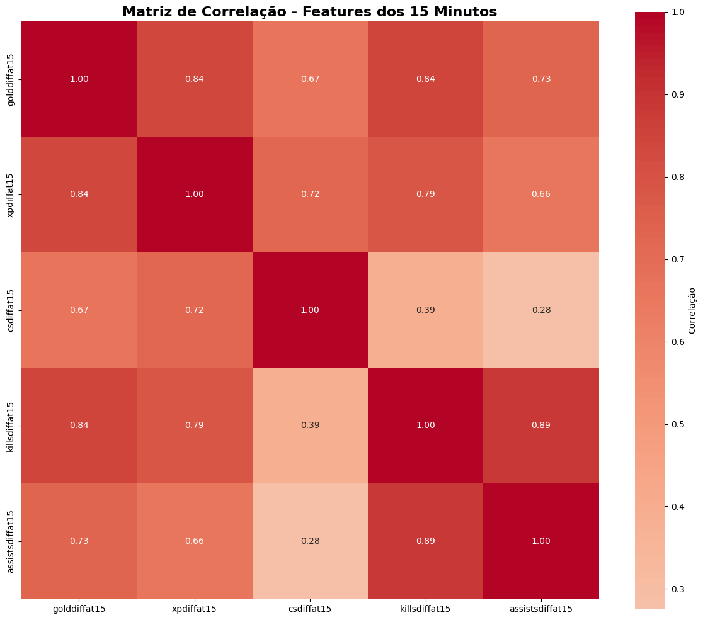

# Prediction of League of Legends Match Outcomes at 15 Minutes

This repository contains the source code, experiments, and documentation for a project comparing classifiers for predicting the winning team in League of Legends (LoL) matches, using only data collected at the 15-minute mark.

## Table of Contents
- [Project Description](#project-description)
- [Requirements](#requirements)
- [How to Run](#how-to-run)
- [Project Structure](#project-structure)
- [Results](#results)
- [Scientific Paper](#scientific-paper)
- [License](#license)

---

## Project Description
The goal of this project is to compare machine learning algorithms to predict, based on a restricted set of variables, which team will win a LoL match. The focus is on early prediction scenarios, using only information available at 15 minutes into the game.

The evaluated classifiers are:
- Decision Tree (DT)
- K-Nearest Neighbors (KNN)
- Multi-Layer Perceptron (MLP)
- Random Forest (RF)
- Heterogeneous Boosting Ensemble (HB)

The code performs preprocessing, training, nested cross-validation, hyperparameter optimization, and statistical analysis of the results.

## Requirements
- Python 3.8+
- Install dependencies with:

```bash
pip install -r requirements.txt
```

## How to Run
1. Make sure the data file `data/jogosLoL2021.csv` is present in the project folder.
2. Run the main script:

```bash
python src/tarefa_iv_predicao_15min.py
```

3. (Optional) Explore and reproduce the experiments in the Jupyter Notebook:

```bash
jupyter notebook src/Trab1_Tarefa_IV.ipynb
```

## Project Structure
```
.
├── .gitignore                          # Git ignore file
├── README.md                           # This file in English
├── README-ptbr.md                      # This file in Portuguese
├── requirements.txt                    # Project dependencies
├── data/                               # Data directory
│   └── jogosLoL2021.csv                # Dataset used
├── src/                                # Source code directory
│   ├── tarefa_iv_predicao_15min.py     # Main experiment script
│   └── Trab1_Tarefa_IV.ipynb           # Notebook with analysis and visualizations
├── results/                            # Results directory
│   ├── tabela_resultados.csv           # Experiment results
│   ├── tabela_pvalues.csv              # Statistical test p-values
│   ├── boxplot_acuracias.png           # Results plot
│   └── matriz_correlacao.png           # Feature correlation matrix
└── docs/                               # Documentation directory
    ├── article-en.pdf                  # Scientific paper (English)
    ├── article-ptbr.pdf                # Scientific paper (Brazilian)
    ├── Trab1 IA 2025.pdf               # Assignment description
    └── ref/                            # References directory
        └── *.pdf                       # Reference papers
```

## Results
Complete results, tables, and plots can be found in `results/tabela_resultados.csv`, `results/tabela_pvalues.csv`, and `results/boxplot_acuracias.png`. The notebook `src/Trab1_Tarefa_IV.ipynb` allows you to explore and reproduce the full analysis.

### Feature Correlation Analysis
The correlation matrix below shows the relationships between the features used at 15 minutes:



The features show the following correlations with the match outcome:
- **golddiffat15**: 0.5596 (highest correlation)
- **xpdiffat15**: 0.5096
- **killsdiffat15**: 0.4843
- **assistsdiffat15**: 0.4311
- **csdiffat15**: 0.4027 (lowest correlation)

## Scientific Paper
The paper describing the methodology, experiments, and analysis of results is available in this repository:
- [English](docs/article-en.pdf)
- [Portuguese (Brazil)](docs/article-ptbr.pdf)

## License
This project is for academic use. See the paper for authorship and citation details.
